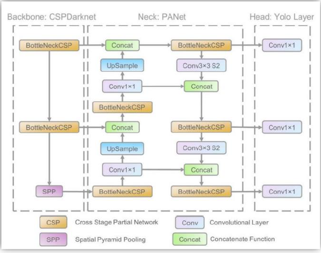
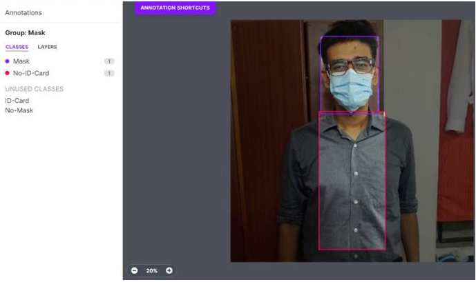
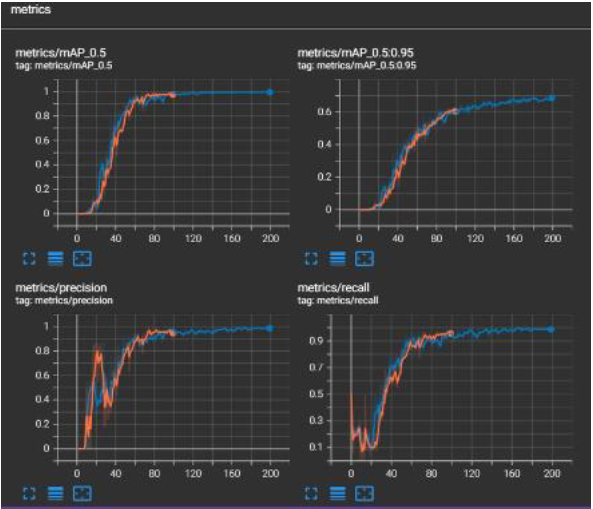
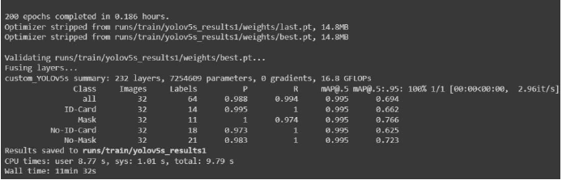
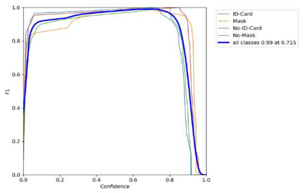
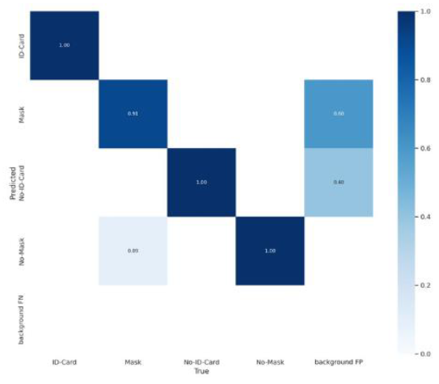
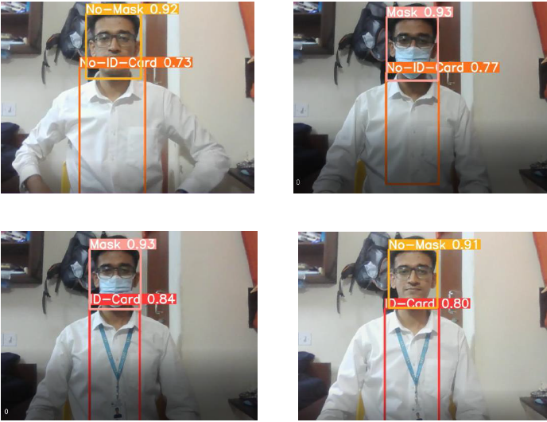

# MaskHelmetDetection-SMMOD

## Overview  
This project presents a **single-model object detection system** built with **YOLOv5** and **PyTorch**, capable of detecting **masks**, **ID cards**, and optionally **helmets** (in extension) in a unified framework. It uses a multi-task learning approach to detect multiple object types in one forward pass — improving efficiency, memory usage, and inference speed compared to multi-model setups.

---

## Motivation  
In many real-world access control and compliance scenarios (e.g., lab/office entry, industrial safety zones), it’s necessary to verify more than one item (mask, ID card, helmet) for each person. Traditional methods often require either multiple separate models or treating all classes as a single multi-class detection, which can lead to inefficiencies or accuracy drop.  
This project addresses that by training a **single detection model** that handles **multiple independent object classes**, achieving high accuracy while staying light enough for CPU inference.

---

## Features  
- One model detects **Mask**, **No-Mask**, **ID-Card**, **No-ID-Card** (and extendable helmet class) simultaneously.  
- Based on **YOLOv5s** backbone, custom-configured for multi-task learning.  
- Custom dataset with manually annotated images for all combinations of mask/ID-card presence.  
- Training and inference pipeline optimised for **real-time CPU execution**.  
- Strong performance: precision ~0.988, recall ~0.994, mAP @ 0.5 ~0.995 (per internal testing).

---

## Architecture  
  
*Figure: Backbone (CSPDarknet) → Neck (PANet) → Head (YOLO Layer)*

- **Backbone (CSPDarknet)**: extracts features from input image  
- **Neck (PANet)**: aggregates multi-scale features  
- **YOLO Head**: predicts bounding boxes, class labels, and confidence  
This design enables efficient detection of multiple object classes in one inference pass.

---

## Modules  
| Module        | Description |
|---------------|-------------|
| `SMMOD.ipynb` | Jupyter notebook orchestrating dataset setup, model configuration, training and inference. |
| `train.py`    | Script for training the model: loads data, configures YOLOv5 model, and runs training epochs. |
| `detect.py`   | Script for running inference on images or video stream, using trained weights (`best.pt`). |
| `yolov5s.yaml`| Model configuration (anchors, layers, hyper-parameters) adapted for this task. |
| `letterbox.py`| Utility for image resizing and padding while preserving aspect ratio for YOLO input. |
| `data/`       | Dataset folder (images + labels) annotated via Roboflow or similar tool. |

---

## Dataset  
  
*Figure: Annotation of mask and ID card presence in sample image.*

- **Total images**: 324  
- **Classes**: Mask, No-Mask, ID-Card, No-ID-Card  
- **Train / Validation / Test split**: ~70% / 20% / 10%  
- Images were manually annotated and converted to YOLO format using a Roboflow pipeline.

---

## Training & Results  
  
*Figure: Precision, Recall, mAP curves over 200 epochs.*

### Summary of key results  
| Metric       | Value  |
|--------------|--------|
| Precision    | ~0.988 |
| Recall       | ~0.994 |
| mAP @ 0.5    | ~0.995 |
| Best confidence threshold for F1 | ~0.715 (F1 ~0.99) |

### Training details  
  
- Layers: 232  
- Parameters: ~7.25 M  
- GFLOPs: ~16.8  
- Training time: ~11 min 32 s on CPU setup (dataset size small)  
- Achieved near-perfect detection on validation/test for dataset combinations.

---

## Evaluation Metrics  
### F1-Score vs Confidence  
  
All classes (Mask, ID-Card, No-Mask, No-ID-Card) show strong performance with F1 peaks close to 0.99.

### Confusion Matrix  
  
The model exhibits minimal false positives/negatives across classes — high separation and accuracy.

---

## Inference Examples  
  
*Figure: Sample detections showing Mask + ID-Card, Mask only, ID-Card only, No-Mask/No-ID combinations.*

These real-world snapshots validate the model’s robust detection across various wearer-combinations and lighting conditions.

---

## Key Takeaways  
- Multi-Task Learning within one model enables efficient detection of multiple objects without needing separate models.  
- The system is light and fast enough for real-world CPU deployment (e.g., access gates, embedded cameras).  
- High accuracy (mAP ~0.995) achieved despite small custom dataset — indicates strong generalisation within the annotated domain.

---

## Tech Stack  
- **Language**: Python  
- **Frameworks**: PyTorch, OpenCV  
- **Model**: YOLOv5s (custom config)  
- **Dataset Tools**: Roboflow (annotation, conversion)  
- **Visualization**: TensorBoard / Matplotlib  

---

## Acknowledgement
- Developed as part of Technical Answers for Real World Problems (CSE1901), School of Computer Science and Engineering, VIT University.
